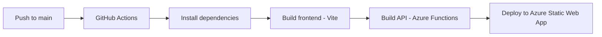

# ChordSheets — Complete System Plan

## 1. Overview

**ChordSheets** is a lightweight Progressive Web App (PWA) for storing, organizing, and retrieving annotated chord sheet PDFs. It is optimized for two primary use cases:

- **iPad**: Upload PDFs and tag them with metadata (title, artist, tags, key, notes)
- **Phone**: Quickly search/browse and view chord sheets full-screen

### Tech Stack
| Layer | Technology |
|-------|-----------|
| Frontend | React 18 + TypeScript, Vite, React Router v6 |
| PDF Viewing | react-pdf (based on pdf.js) |
| PWA | vite-plugin-pwa (Workbox) |
| CSS | Tailwind CSS |
| Backend | Azure Functions v4 (Node.js + TypeScript) |
| Database | Azure Cosmos DB (NoSQL, free tier) |
| File Storage | Azure Blob Storage (Hot tier) |
| Hosting | Azure Static Web App (free tier) |
| CI/CD | GitHub Actions |

### Estimated Monthly Cost
| Service | Tier | Cost |
|---------|------|------|
| Azure Static Web App | Free | $0 |
| Azure Functions | Bundled with SWA (free) | $0 |
| Azure Blob Storage | Hot tier, ~5GB | ~$0.10 |
| Azure Cosmos DB | Free tier (1000 RU/s, 25GB) | $0 |
| Custom Domain (optional) | N/A | ~$10/year |
| **Total** | | **~$0.10/month** |

---

## 2. Project Structure

```
chordsheets/
├── plans/
│   └── chordsheets-plan.md          # This file
├── src/                              # React frontend
│   ├── components/
│   │   ├── Layout.tsx                # App shell: header + navigation
│   │   ├── SearchBar.tsx             # Universal search input
│   │   ├── TagCloud.tsx              # Clickable tag buttons
│   │   ├── SongCard.tsx              # Song preview card in list/grid
│   │   ├── SongList.tsx              # Grid/list of SongCards
│   │   ├── PDFViewer.tsx             # Full-screen PDF rendering
│   │   ├── UploadForm.tsx            # Upload form with tag autocomplete
│   │   ├── EditSongModal.tsx         # Edit metadata modal
│   │   ├── TagInput.tsx              # Tag autocomplete input component
│   │   ├── ConfirmDialog.tsx         # Reusable confirm/cancel dialog
│   │   └── EmptyState.tsx            # Shown when no songs match
│   ├── pages/
│   │   ├── HomePage.tsx              # Search bar + tag cloud + recent songs
│   │   ├── BrowsePage.tsx            # Full song list with filters
│   │   ├── SongPage.tsx              # PDF viewer for a single song
│   │   ├── UploadPage.tsx            # Upload + tag a new song
│   │   └── NotFoundPage.tsx          # 404 page
│   ├── hooks/
│   │   ├── useSongs.ts              # Fetch/search/filter songs
│   │   ├── useTags.ts               # Fetch all tags for autocomplete
│   │   ├── useUpload.ts             # Upload PDF + metadata
│   │   └── useSong.ts               # Fetch single song by ID
│   ├── services/
│   │   └── api.ts                   # API client (fetch wrapper)
│   ├── types/
│   │   └── index.ts                 # TypeScript interfaces
│   ├── utils/
│   │   └── helpers.ts               # Formatting, slug generation, etc.
│   ├── App.tsx                       # Router setup
│   ├── main.tsx                      # Entry point
│   └── index.css                     # Tailwind imports + global styles
├── api/                              # Azure Functions backend
│   ├── src/
│   │   ├── functions/
│   │   │   ├── songs.ts             # GET /api/songs (list + search)
│   │   │   ├── song.ts              # GET /api/songs/:id
│   │   │   ├── createSong.ts        # POST /api/songs
│   │   │   ├── updateSong.ts        # PUT /api/songs/:id
│   │   │   ├── deleteSong.ts        # DELETE /api/songs/:id
│   │   │   └── tags.ts              # GET /api/tags
│   │   └── shared/
│   │       ├── cosmos.ts            # Cosmos DB client + helpers
│   │       ├── blob.ts              # Blob Storage client + helpers
│   │       └── types.ts             # Shared TypeScript types
│   ├── host.json                    # Azure Functions host config
│   ├── package.json
│   └── tsconfig.json
├── public/
│   ├── favicon.ico
│   ├── icon-192.png                 # PWA icon
│   ├── icon-512.png                 # PWA icon
│   └── manifest.json                # PWA manifest (generated by plugin)
├── staticwebapp.config.json          # Azure SWA routing config
├── package.json
├── tsconfig.json
├── vite.config.ts
├── tailwind.config.js
├── postcss.config.js
├── index.html
├── .env.example                      # Environment variables template
├── .gitignore
└── README.md
```

---

## 3. Data Model

### Song Document (Cosmos DB)

```typescript
interface Song {
  id: string;              // Auto-generated UUID
  title: string;           // e.g. "From Now On"
  artist: string;          // e.g. "The Greatest Showman"
  tags: string[];          // e.g. ["musical theater", "movie", "upbeat"]
  key?: string;            // e.g. "Bb Major" (optional)
  notes?: string;          // e.g. "Simplified bridge" (optional)
  pdfBlobName: string;     // Blob storage filename, e.g. "abc123.pdf"
  pdfUrl: string;          // Full Blob URL for fetching
  dateAdded: string;       // ISO 8601 timestamp
  dateModified: string;    // ISO 8601 timestamp
}
```

### Cosmos DB Configuration
- **Database name**: `chordsheets`
- **Container name**: `songs`
- **Partition key**: `/id` (even distribution, each song is its own partition)
- **Indexing**: Default indexing on all properties (supports queries on title, artist, tags)

### Blob Storage Configuration
- **Container name**: `pdfs`
- **Access level**: Private (accessed through Azure Functions with SAS tokens or proxy)
- **Naming convention**: `{song-id}.pdf` (matches Cosmos document ID)
- **Max file size**: 25MB per PDF (more than enough for annotated sheets)

---

## 4. API Specification

All endpoints are served under `/api/` and auto-proxied by Azure Static Web App.

### 4.1 GET /api/songs

**Purpose**: List songs with optional search/filter.

**Query Parameters**:
| Param | Type | Description |
|-------|------|-------------|
| `q` | string | Search term — matches against title, artist, and tags |
| `tag` | string | Filter by exact tag name |
| `sort` | string | `title` (default), `dateAdded`, `artist` |
| `order` | string | `asc` (default), `desc` |
| `limit` | number | Max results (default: 50) |
| `offset` | number | Pagination offset (default: 0) |

**Response** (200):
```json
{
  "songs": [
    {
      "id": "abc-123",
      "title": "From Now On",
      "artist": "The Greatest Showman",
      "tags": ["musical theater", "movie"],
      "key": "Bb Major",
      "dateAdded": "2026-05-01T12:00:00Z"
    }
  ],
  "total": 142,
  "limit": 50,
  "offset": 0
}
```

**Cosmos DB Query Logic**:
```sql
-- When q="laufey":
SELECT * FROM songs s
WHERE CONTAINS(LOWER(s.title), "laufey")
   OR CONTAINS(LOWER(s.artist), "laufey")
   OR ARRAY_CONTAINS(s.tags, "laufey")
ORDER BY s.title ASC
OFFSET 0 LIMIT 50

-- When tag="jazz standard":
SELECT * FROM songs s
WHERE ARRAY_CONTAINS(s.tags, "jazz standard")
ORDER BY s.title ASC
OFFSET 0 LIMIT 50
```

### 4.2 GET /api/songs/:id

**Purpose**: Get full song details (metadata + PDF URL).

**Response** (200):
```json
{
  "id": "abc-123",
  "title": "From Now On",
  "artist": "The Greatest Showman",
  "tags": ["musical theater", "movie"],
  "key": "Bb Major",
  "notes": "Simplified bridge section",
  "pdfUrl": "https://chordsheets.blob.core.windows.net/pdfs/abc-123.pdf?sv=...",
  "dateAdded": "2026-05-01T12:00:00Z",
  "dateModified": "2026-05-01T12:00:00Z"
}
```

Note: `pdfUrl` includes a time-limited SAS token for secure access.

### 4.3 POST /api/songs

**Purpose**: Upload a new song.

**Request**: `multipart/form-data`
| Field | Type | Required |
|-------|------|----------|
| `title` | string | Yes |
| `artist` | string | Yes |
| `tags` | string (JSON array) | Yes |
| `key` | string | No |
| `notes` | string | No |
| `pdf` | file (PDF) | Yes |

**Response** (201):
```json
{
  "id": "abc-123",
  "title": "From Now On",
  "message": "Song uploaded successfully"
}
```

**Backend Logic**:
1. Validate required fields and file type (must be PDF)
2. Generate UUID for the song
3. Upload PDF to Blob Storage as `{id}.pdf`
4. Create Cosmos DB document with metadata + blob reference
5. Return success with song ID

### 4.4 PUT /api/songs/:id

**Purpose**: Update song metadata (and optionally replace PDF).

**Request**: `multipart/form-data` (same fields as POST, all optional except at least one must change)

**Response** (200):
```json
{
  "id": "abc-123",
  "message": "Song updated successfully"
}
```

### 4.5 DELETE /api/songs/:id

**Purpose**: Delete a song and its PDF.

**Response** (200):
```json
{
  "message": "Song deleted successfully"
}
```

**Backend Logic**:
1. Delete PDF from Blob Storage
2. Delete document from Cosmos DB

### 4.6 GET /api/tags

**Purpose**: Get all unique tags with song counts (for tag cloud and autocomplete).

**Response** (200):
```json
{
  "tags": [
    { "name": "musical theater", "count": 34 },
    { "name": "jazz standard", "count": 28 },
    { "name": "disney", "count": 15 },
    { "name": "pop", "count": 42 },
    { "name": "laufey", "count": 12 }
  ]
}
```

**Implementation**: Query all songs, aggregate tags in-memory (efficient up to thousands of songs). Optionally, cache this result.

---

## 5. Frontend Pages & UI Design

### 5.1 Home Page (/)

The landing page — what you see when you open the app on your phone.

```
┌─────────────────────────────┐
│  ♫ ChordSheets              │
├─────────────────────────────┤
│  ┌─────────────────────┐    │
│  │ 🔍 Search songs...  │    │
│  └─────────────────────┘    │
│                             │
│  Tags:                      │
│  ┌──────────┐ ┌─────┐      │
│  │ pop (42) │ │jazz │      │
│  └──────────┘ └─────┘      │
│  ┌──────────────┐ ┌──────┐ │
│  │ musical      │ │disney│ │
│  │ theater (34) │ │ (15) │ │
│  └──────────────┘ └──────┘ │
│  ┌────────────┐ ┌────────┐ │
│  │laufey (12) │ │holiday │ │
│  └────────────┘ └────────┘ │
│                             │
│  Recently Added:            │
│  ┌─────────────────────┐    │
│  │ From Now On          │    │
│  │ The Greatest Showman │    │
│  │ musical theater      │    │
│  └─────────────────────┘    │
│  ┌─────────────────────┐    │
│  │ Like a Star          │    │
│  │ Laufey               │    │
│  │ jazz, laufey         │    │
│  └─────────────────────┘    │
│                             │
├─────────────────────────────┤
│  🏠 Home  📚 Browse  ➕ Add │
└─────────────────────────────┘
```

**Behavior**:
- Search bar at top: typing filters songs in real-time (debounced API calls)
- Tag cloud: tap a tag → navigates to Browse page filtered by that tag
- Recently added: shows last 10 songs added, sorted by dateAdded desc
- Bottom nav: 3 tabs — Home, Browse, Add

### 5.2 Browse Page (/browse)

Full library view with all songs.

```
┌─────────────────────────────┐
│  ♫ ChordSheets              │
├─────────────────────────────┤
│  ┌─────────────────────┐    │
│  │ 🔍 Search songs...  │    │
│  └─────────────────────┘    │
│                             │
│  Filter by tag:             │
│  [musical theater ✕] [All▾] │
│                             │
│  Sort: Title ▾              │
│                             │
│  Showing 34 songs           │
│  ┌─────────────────────┐    │
│  │ A Million Dreams     │    │
│  │ The Greatest Showman │    │
│  │ Bb Major             │    │
│  └─────────────────────┘    │
│  ┌─────────────────────┐    │
│  │ Defying Gravity      │    │
│  │ Wicked               │    │
│  │ G Major              │    │
│  └─────────────────────┘    │
│  ┌─────────────────────┐    │
│  │ From Now On          │    │
│  │ The Greatest Showman │    │
│  │ Bb Major             │    │
│  └─────────────────────┘    │
│  ... (scrollable list)      │
│                             │
├─────────────────────────────┤
│  🏠 Home  📚 Browse  ➕ Add │
└─────────────────────────────┘
```

**Behavior**:
- Same search bar — synced with URL params
- Active tag filters shown as chips with ✕ to remove
- Tag dropdown to add more filters
- Sort by: Title (A-Z), Artist (A-Z), Date Added (newest first)
- Tap a song card → navigates to Song Page
- Long-press or swipe a song card → shows Edit / Delete options
- Infinite scroll or "Load More" button for pagination

### 5.3 Song Page (/songs/:id)

Full-screen PDF viewer — the core "playing from my phone" experience.

```
┌─────────────────────────────┐
│ ← Back   From Now On    ⋮  │
├─────────────────────────────┤
│                             │
│                             │
│   ┌─────────────────────┐   │
│   │                     │   │
│   │   [PDF rendered     │   │
│   │    full-width,      │   │
│   │    scrollable,      │   │
│   │    pinch-to-zoom]   │   │
│   │                     │   │
│   │                     │   │
│   │                     │   │
│   │                     │   │
│   └─────────────────────┘   │
│                             │
│                             │
└─────────────────────────────┘
```

**Behavior**:
- Header: back button, song title, overflow menu (⋮) with Edit / Delete
- PDF fills the screen — optimized for phone landscape too
- Pinch-to-zoom and scroll supported (react-pdf handles this)
- No bottom nav bar — maximum screen real estate for the PDF
- Swipe from edge or tap back to return to previous page

### 5.4 Upload Page (/add)

The iPad-optimized upload experience.

```
┌─────────────────────────────────────────┐
│  ♫ ChordSheets — Add Song               │
├─────────────────────────────────────────┤
│                                         │
│  Title *                                │
│  ┌─────────────────────────────────┐    │
│  │ From Now On                     │    │
│  └─────────────────────────────────┘    │
│                                         │
│  Artist *                               │
│  ┌─────────────────────────────────┐    │
│  │ The Greatest Showman            │    │
│  └─────────────────────────────────┘    │
│                                         │
│  Tags * (type to add, select existing)  │
│  ┌─────────────────────────────────┐    │
│  │ musical theater ✕ | movie ✕ |  │    │
│  │ type here...                    │    │
│  └─────────────────────────────────┘    │
│  Suggestions: upbeat, ballad, disney    │
│                                         │
│  Key (optional)                         │
│  ┌─────────────────────────────────┐    │
│  │ Bb Major                  [▾]  │    │
│  └─────────────────────────────────┘    │
│                                         │
│  Notes (optional)                       │
│  ┌─────────────────────────────────┐    │
│  │ Simplified bridge section       │    │
│  └─────────────────────────────────┘    │
│                                         │
│  PDF File *                             │
│  ┌─────────────────────────────────┐    │
│  │  📄 From_Now_On.pdf    [Change] │    │
│  └─────────────────────────────────┘    │
│                                         │
│  ┌─────────────────────────────────┐    │
│  │         Upload Song ✓           │    │
│  └─────────────────────────────────┘    │
│                                         │
├─────────────────────────────────────────┤
│  🏠 Home    📚 Browse    ➕ Add         │
└─────────────────────────────────────────┘
```

**Behavior**:
- Large touch-friendly inputs (iPad-optimized)
- Tag input with autocomplete AND creation:
  - As you type, a dropdown shows **existing tags** that match (with song counts)
  - Tap an existing tag to add it
  - If your text does not match any existing tag, a **"Create new tag: ..."** option appears at the top of the dropdown
  - Tap it to create and add the new tag in one step
  - Selected tags appear as removable chips with ✕
  - Tags are not managed separately — they exist organically as long as at least one song uses them; if all songs are removed from a tag, it disappears from the tag cloud
- Key selector: dropdown with common keys (C, C#, D, ... plus Major/Minor)
- PDF file picker: tap to select from Files app
- Validation: title, artist, at least one tag, and PDF are required
- On submit: shows loading spinner → success message → option to add another or go to library
- After successful upload, user sees the song in the library immediately

### 5.5 Edit Song Modal

Appears when editing from Browse or Song page.

**Same fields as Upload page**, pre-filled with existing data. PDF replacement is optional — if no new PDF is selected, the existing one stays. Includes a "Delete Song" button in red at the bottom.

---

## 6. Frontend Routes

| Route | Page | Description |
|-------|------|-------------|
| `/` | HomePage | Search + tag cloud + recent songs |
| `/browse` | BrowsePage | Full library with filters |
| `/browse?tag=jazz` | BrowsePage | Pre-filtered by tag |
| `/browse?q=laufey` | BrowsePage | Pre-filtered by search |
| `/songs/:id` | SongPage | Full-screen PDF viewer |
| `/add` | UploadPage | Upload + tag new song |
| `*` | NotFoundPage | 404 |

---

## 7. PWA Configuration

### Manifest
```json
{
  "name": "ChordSheets",
  "short_name": "Chords",
  "description": "Personal digital fake book",
  "theme_color": "#1e293b",
  "background_color": "#0f172a",
  "display": "standalone",
  "orientation": "any",
  "start_url": "/",
  "icons": [
    { "src": "/icon-192.png", "sizes": "192x192", "type": "image/png" },
    { "src": "/icon-512.png", "sizes": "512x512", "type": "image/png" }
  ]
}
```

### Service Worker Strategy (via vite-plugin-pwa + Workbox)
- **App shell**: Cache-first (HTML, CSS, JS — always available)
- **API calls**: Network-first with cache fallback (song list works offline if previously loaded)
- **PDFs**: Cache-first after first load (once you view a song, it is cached for offline use)
- **Images/icons**: Cache-first

This means: if you lose signal at a gig, songs you have previously viewed will still be available.

---

## 8. Key Musical Key Dropdown Values

For the optional "Key" field, these predefined values will be available:

```
C Major, C Minor, C# Major, C# Minor,
D Major, D Minor, Eb Major, Eb Minor,
E Major, E Minor, F Major, F Minor,
F# Major, F# Minor, G Major, G Minor,
Ab Major, Ab Minor, A Major, A Minor,
Bb Major, Bb Minor, B Major, B Minor
```

---

## 9. Security & Authentication

### Phase 1 (MVP — No Auth)
- No login required
- The app is only accessible if you know the URL
- Azure Blob Storage is private; PDFs are accessed through the API (which generates short-lived SAS tokens)
- This is acceptable for a personal tool

### Phase 2 (Optional Future)
- Add Azure AD B2C or a simple password gate
- Protect all API endpoints
- Only needed if the URL becomes shared or you want extra security

---

## 10. Deployment Pipeline

### GitHub Actions Workflow

Triggered on push to `main` branch:



### Azure Resources to Create
1. **Resource Group**: `chordsheets-rg`
2. **Azure Static Web App**: `chordsheets-app` (Free tier, linked to GitHub repo)
3. **Azure Cosmos DB Account**: `chordsheets-db` (Free tier, NoSQL API)
4. **Azure Storage Account**: `chordsheetsblob` (Hot tier, LRS redundancy)

### Environment Variables (Azure Functions Application Settings)
```
COSMOS_ENDPOINT=https://chordsheets-db.documents.azure.com:443/
COSMOS_KEY=<primary-key>
COSMOS_DATABASE=chordsheets
COSMOS_CONTAINER=songs
BLOB_CONNECTION_STRING=<connection-string>
BLOB_CONTAINER=pdfs
```

---

## 11. Implementation Order

| Step | Task | Dependencies |
|------|------|-------------|
| 1 | Project scaffolding: Vite + React + TypeScript + Tailwind + PWA plugin | None |
| 2 | Azure Functions project structure with TypeScript | None |
| 3 | Cosmos DB data model + shared DB client | Step 2 |
| 4 | Blob Storage shared client | Step 2 |
| 5 | API: POST /api/songs (upload) | Steps 3, 4 |
| 6 | API: GET /api/songs (list + search) | Step 3 |
| 7 | API: GET /api/songs/:id | Step 3 |
| 8 | API: PUT /api/songs/:id (update) | Steps 3, 4 |
| 9 | API: DELETE /api/songs/:id | Steps 3, 4 |
| 10 | API: GET /api/tags | Step 3 |
| 11 | Frontend: TypeScript types + API client | Step 1 |
| 12 | Frontend: Layout + Bottom Nav | Step 1 |
| 13 | Frontend: Home Page (search + tag cloud + recent) | Steps 6, 10, 11, 12 |
| 14 | Frontend: Browse Page (full list + filters + sort) | Steps 6, 11, 12 |
| 15 | Frontend: Song Page (PDF viewer) | Steps 7, 11 |
| 16 | Frontend: Upload Page (form + file upload) | Steps 5, 10, 11, 12 |
| 17 | Frontend: Edit/Delete functionality | Steps 8, 9, 11 |
| 18 | PWA: manifest, service worker, offline caching | Step 1 |
| 19 | Mobile-first responsive styling polish | Steps 12-17 |
| 20 | Azure resource provisioning | None (can be parallel) |
| 21 | Deployment pipeline (GitHub Actions) | Step 20 |
| 22 | End-to-end testing on iPad + phone | All steps |

---

## 12. Future Enhancements (Not in MVP)

These are explicitly out of scope for the initial build but worth noting for later:

- **Setlists**: Group songs into ordered setlists for specific performances
- **Favorites**: Star songs for quick access
- **Recently Viewed**: Track and show recently opened songs
- **Transpose**: Digital transpose overlay (would require parsing chord data)
- **Full-text search**: Azure AI Search for searching lyric content inside PDFs
- **Authentication**: Password protection or Azure AD B2C
- **Backup/Export**: Export entire library as a ZIP
- **Bulk upload**: Upload multiple PDFs at once with batch tagging
